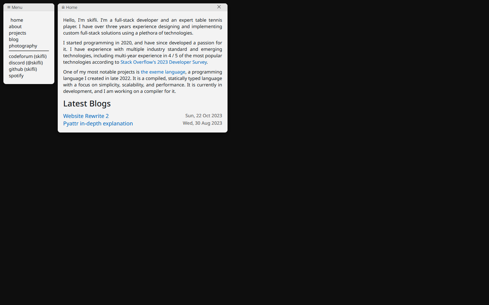

# [skifli.github.io](https://skifli.github.io)

- [skifli.github.io](#skifligithubio)
  - [Introduction](#introduction)
  - [Preview](#preview)
  - [TODO](#todo)
    - [Requirements](#requirements)
    - [Features](#features)

## Introduction

This is where the code for my portfolio website is held. It functions akin to an OS, as in it has functioning windows that can be resized, moved, and closed.

## Preview

> [!NOTE]\
> This screenshot is from a development version of the website from **22.10.2023**. It may have changed *partially*, *drastically*, or *not at all* since then.

## TODO

### Requirements

- [ ] Add mobile support.

### Features

- [ ] Add a mechanism that tracks page chanes, and so if a 404 does happen then the log can be shown to the user to help me debug what happened.